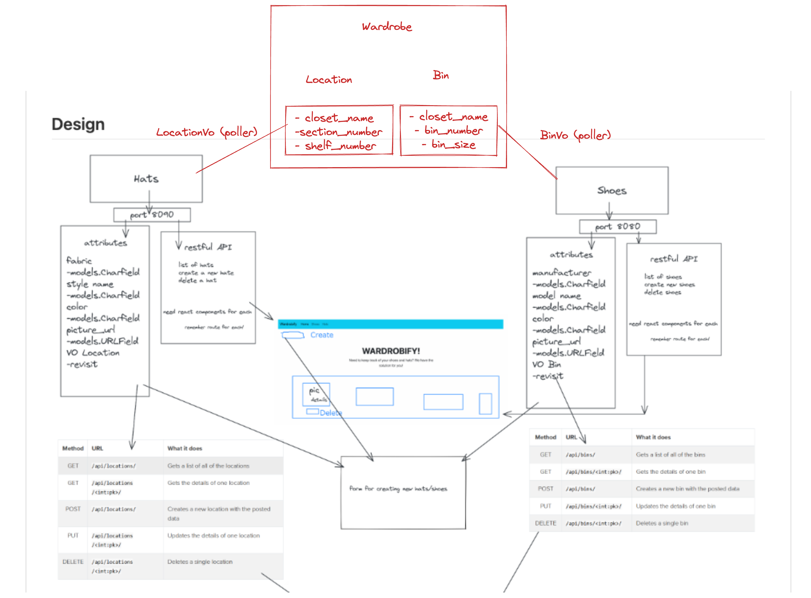

# Wardrobify

Team:

* Person1 (Christie) - Hat microservice
* Person 2 (Vincent) - Shoes microservice

## Design
Wardrobify is an application that allows people to view a list of shoes and hats and create new shoes and hats. It’s developed through Hats, Shoes, and Wardrobe APIs on the backend and through React on the frontend.

Within the repository, you’ll find ghi, hats, shoes, and wardrobe directories.

- ghi contains the front-end React files
- hats contains the back-end api for managing hats
- shoes contains the back-end api for managing shoes
- wardrobe contains the back-end api for managing wardrobe locations and bins

## Shoes microservice

The shoes microservice consists of two models, Shoe and BinVO. The shoe model has a bin property which has a ForeignKey relationship to BinVO.

The BinVO object is created by using a get_bins() polling function that makes a request to the Wardrobe API's bins endpoint and accessing the bin data.

RESTFUL API's have been established by creating two endpoints to get a list of shoes, create a new shoe, and delete a shoe.

On the front end, two components were created: ShoeList and ShoeForm. ShoeForm utilized the useState and useEffect hooks. ShoeForm fetched data from wardrobe API in order to get a list of the bins available when creating a form.

## Hats microservice

The hats microservice consists of two models, Hat and LocationVO. The hat model has a location property which has a ForeignKey relationship to LocationVO.

The LocationVO object is created by using a get_locations() polling function that makes a request to the Wardrobe API's locations endpoint and accessing the location data.

RESTFUL API's have been established by creating two endpoints to get a list of hats, create a new hat, and delete a hat.

On the front end, two components were created: HatList and HatForm. HatForm utilized setState and componentDidMount class components. HatForm fetched data from wardrobe API in order to get a list of the locations available when creating a form.
